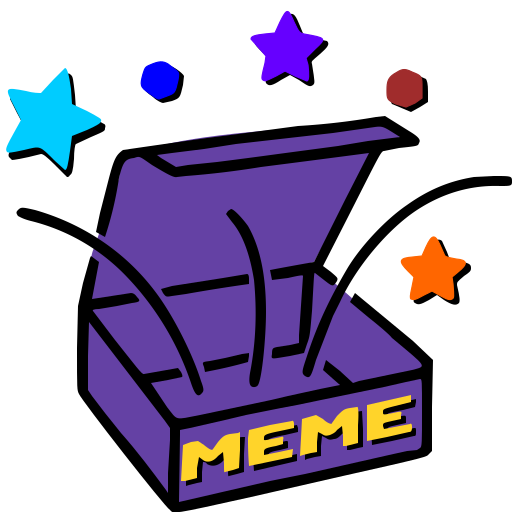
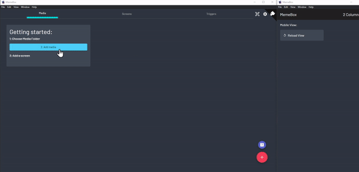
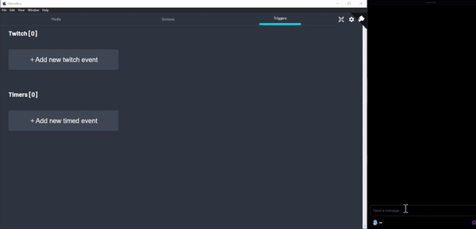

# Meme-Box | [Getting Started](#getting-started) | [How to contribute](#how-to-help--contribute)

<!-- ALL-CONTRIBUTORS-BADGE:START - Do not remove or modify this section -->

<!-- ALL-CONTRIBUTORS-BADGE:END -->

A complete management app for [`image / audio / video / iframe / widgets`](/tutorials/type_overview.md) "media" to be used inside OBS. Or trigger other custom actions.

|**Media Setup Example + Mobile View**|**Setup a Twitch-Trigger**|
|--|--|
|||

## Download

[Download latest release!](https://github.com/negue/meme-box/releases) (currently a bit ouf of date, new release soon) - [latest nightly Builds](https://github.com/negue/meme-box-nightly/releases)

## Working Features

<table>
  <tr>
    <th>Show Media</th>
    <th>Screens (in OBS) </th>
    <th colspan=2>Triggers </th>
  </tr>
  <tr>
    <td>Images</td>
    <td rowspan=7>

Animations on show / hide
[Visibility][URL_ADVANCED_SETTINGS]:
- Play (on a trigger)
- Toggle (per trigger)
- Always Visible

[Custom Position per Media / Screen][URL_ADVANCED_SETTINGS]:
- Fullscreen
- Fixed (on a position)
- Centered
- Random

Misc:
- [Custom CSS per Media / Screen][URL_ADVANCED_SETTINGS]
- drag&drop for better position items
- rotate/size/warp items
</td>
<td rowspan=7 valign="top">

[✅ `Streamdeck Plugin`][STREAMDECK_PLUGIN]
 
[✅ `Deckboard Plugin`](https://github.com/gigili/deckboard-memebox)
 
✅ Timers  
✅ Mobile View  
✅ Twitch Events 
<ul>
    <li> Bits </li>
    <li> Channel Points </li>
    <li> Message </li>
    <li> Raid </li>
    <li> User Ban </li>
    <li> Subscription </li>
    <li> Gift Sub </li>
</ul>

</td>
  </tr>
  <tr>
    <td>Videos</td>
  </tr>
  <tr>
    <td>Iframes</td>
  </tr>
  <tr>
    <td>Widgets</td>
  </tr>
  <tr>
    <td>Play Audio</td>
  </tr>
   <tr>
    <th>Actions</th>
  </tr>

  <tr>
    <td>

[`Trigger multiple / random Media`][URL_RECIPE]
</td>
  </tr>
   <tr>
    <th colspan=3>Scripts (Action)</th>
  </tr>

  <tr>
    <td colspan=3>

- Trigger other Actions with custom logic/timeouts/overrides
- Trigger OBS functions
- Write to Twitch Chat
</td>

</tr>
   <tr>
    <th colspan=3>Permanent Script</th>
  </tr>

<tr>
    <td colspan=3>

- Same as Scripts just that those will run and stay active all the time.
- Used for Bots or other functionalities
- React on custom callbacks from Twitch / OBS Events
- Create your own WebSocket-Server - see [`Script-API examples`][URL_SCRIPTS]
</td>
  </tr>

  <tr>
    <th colspan=3>API for Developers</th>
  </tr>

  <tr>
    <td colspan=3>

- Trigger Actions with WebSockets
- Receive all Twitch Events using WebSockets `/ws/twitch_events` to use in other Apps / Overlays
- Twitch Helix REST bridge `/api/twitchData/helix/*` instead of `https://api.twitch.tv/helix/`
  </td>
  </tr>
</table>

-----

## Getting Started

> Note: These are the current `Getting Started` / Tutorials for this branch.
>
> To see the updated `Getting Started` / Tutorials from the released version - [click here!](https://github.com/negue/meme-box/tree/release#getting-started)

[`Installation and Getting Started`](https://github.com/meme-box/memebox-101/blob/main/00/README.md)

`Advanced`:

- [`Trigger multiple / randoms`][URL_RECIPE]
- [`Screen / Media Settings`][URL_ADVANCED_SETTINGS]
- [`Scripts`][URL_SCRIPTS]
- [`Widgets`][URL_WIDGETS]

[URL_RECIPE]: tutorials/recipe.md
[URL_SCRIPTS]: tutorials/scripts.md
[URL_WIDGETS]: tutorials/widgets.md
[URL_ADVANCED_SETTINGS]: ./tutorials/screen_media_advanced_settings.md
[STREAMDECK_PLUGIN]: ./memebox-streamdeck/Release/com.memebox.memebox-streamdeck.streamDeckPlugin

___

## Roadmap

### 2022.1
See finished and upcoming changes in:
- [CHANGELOG.md](CHANGELOG.md)
- [`Milestone 2022.1`](https://github.com/negue/meme-box/milestone/5)

### 2022.2
* [ ] Labels on or around the Media, each with their own Position / Animation
  * [ ] Changeable by Trigger Variables
  * [ ] Can be placed like in the Arrange View
* [ ] OBS Websockets
  * [ ] Screen Arrange View gets the current OBS-Scene as Background to move stuff around
* [ ] Overview of local media files not existing anymore
* [ ] Replace all selected Trigger Action with an inline Recipes #439

### Future, if you want to help open a PR :)
* [ ] Change media options by triggered variables (e.g. different style, or something)
* [ ] Stats per commands / media / or something last cheerer and so on
* [ ] more to be added :)

## How to help / contribute?
* Improve Docs / Translations
* Find bugs
* Suggestions to make `things` (UI, Text, Docs etc) more understandable
* Help fix bugs / improve features
  * [Good First Issues](https://github.com/negue/meme-box/labels/good%20first%20issue) 
  * [Open for Contribution](https://github.com/negue/meme-box/labels/open%20for%20contribution)
  * [Developers Sanity](https://github.com/negue/meme-box/labels/developers%20sanity)
  * or all other Issue, in case I missed to label them: https://github.com/negue/meme-box/issues 
* Star it :)

[`Getting started with Development`](README_DEV.md)

## Contributors ✨

Thanks goes to these wonderful people ([emoji key](https://allcontributors.org/docs/en/emoji-key)):

<!-- ALL-CONTRIBUTORS-LIST:START - Do not remove or modify this section -->
<!-- prettier-ignore-start -->
<!-- markdownlint-disable -->
<table>
  <tr>
    <td align="center"><a href="http://www.twitch.tv/littleheroesspark"> <b>Aaron Rackley</b></a> <a href="https://github.com/negue/meme-box/commits?author=ageddesi" title="Code">💻</a></td>
    <td align="center"><a href="http://twitch.tv/whitep4nth3r"> <b>Salma @whitep4nth3r</b></a> <a href="https://github.com/negue/meme-box/commits?author=whitep4nth3r" title="Code">💻</a> <a href="#ideas-whitep4nth3r" title="Ideas, Planning, & Feedback">🤔</a> <a href="#design-whitep4nth3r" title="Design">🎨</a></td>
    <td align="center"><a href="https://twitch.tv/gacbl"> <b>Igor Ilic</b></a> <a href="https://github.com/negue/meme-box/issues?q=author%3Agigili" title="Bug reports">🐛</a> <a href="#ideas-gigili" title="Ideas, Planning, & Feedback">🤔</a> <a href="https://github.com/negue/meme-box/commits?author=gigili" title="Code">💻</a> <a href="https://github.com/negue/meme-box/commits?author=gigili" title="Documentation">📖</a></td>
    <td align="center"><a href="https://github.com/CrypticEngima"> <b>CrypticEngima</b></a> <a href="#design-CrypticEngima" title="Design">🎨</a></td>
    <td align="center"><a href="https://github.com/owehmer"> <b>Oliver</b></a> <a href="https://github.com/negue/meme-box/issues?q=author%3Aowehmer" title="Bug reports">🐛</a> <a href="https://github.com/negue/meme-box/commits?author=owehmer" title="Code">💻</a></td>
    <td align="center"><a href="https://github.com/jonathanbucci"> <b>jonathanbucci</b></a> <a href="https://github.com/negue/meme-box/commits?author=jonathanbucci" title="Documentation">📖</a></td>
    <td align="center"><a href="https://www.linkedin.com/in/divs/"> <b>Divyanshu Singh</b></a> <a href="https://github.com/negue/meme-box/commits?author=divshacker" title="Code">💻</a></td>
  </tr>
  <tr>
    <td align="center"><a href="https://brandonroberts.dev"> <b>Brandon</b></a> <a href="https://github.com/negue/meme-box/commits?author=brandonroberts" title="Code">💻</a></td>
    <td align="center"><a href="https://www.linkedin.com/in/chirag-mahawar/"> <b>Chirag Mahawar</b></a> <a href="https://github.com/negue/meme-box/commits?author=chiragmahawar7" title="Code">💻</a></td>
  </tr>
</table>

<!-- markdownlint-restore -->
<!-- prettier-ignore-end -->

<!-- ALL-CONTRIBUTORS-LIST:END -->

This project follows the [all-contributors](https://github.com/all-contributors/all-contributors) specification. Contributions of any kind welcome!
